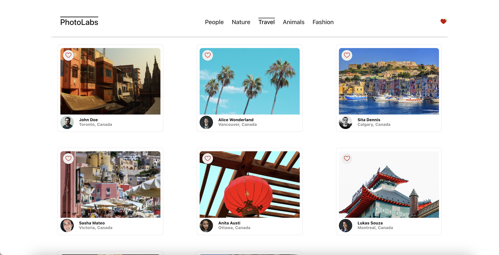
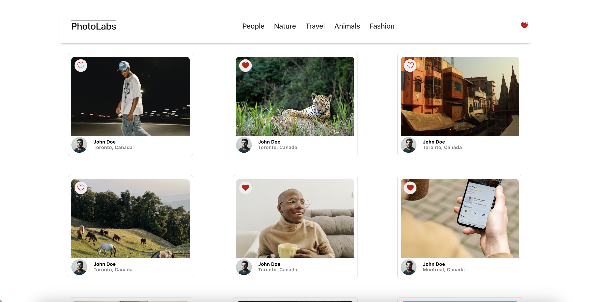
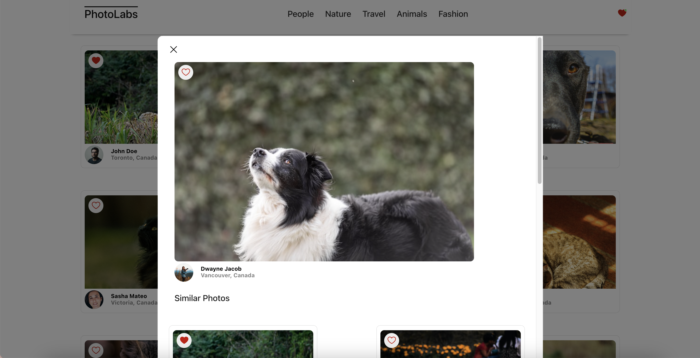

# react-photolabs

The PhotoLabs project for the Web Development React course programming.

# Photolabs

PhotoLabs is a simple stock photo application - specifically a React-based single-page application (SPA) that allows users to view photos in different contexts.

## Feature

1. Sort and navigate to view photos categorized by different topics
   
2. Click on heart icons to like a photo and get a notification in the navigation bar indicated by a green light.
   
3. Click on a photo to view a larger version of the photo and relevant / similar photos
   

## Setup

Install dependencies with `npm install` in each respective `/frontend` and `/backend`.

## [Frontend] Running Webpack Development Server

```sh
cd frontend
npm start
```

## [Backend] Running Backend Servier

Read `backend/readme` for further setup details.

```sh
cd backend
npm start
```
